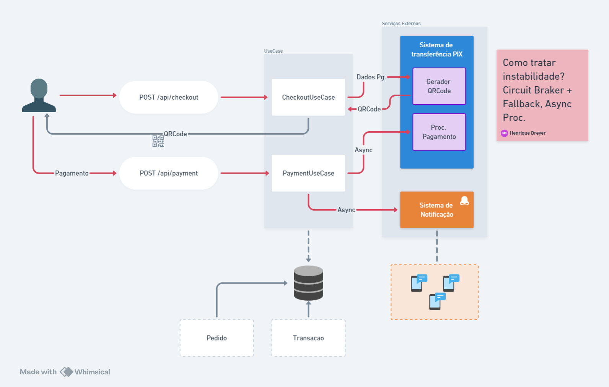
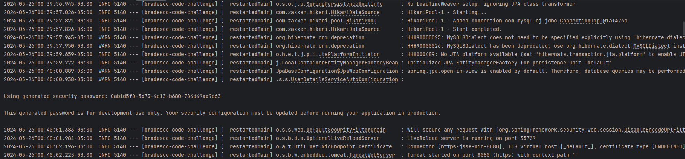

# :bank: Bradesco Code Challenge
### Definição do problema

_Deseja-se realizar a integração do sistema de checkout de lojas virtuais com o sistema de
transferência por PIX para realização de pagamento de compras realizadas. Para isso, será
necessária a construção de um sistema de APIs online para recebimento de transações de
pagamento das lojas, persistência em uma base local, envio para o sistema de processamento
PIX, recebimento da confirmação de pagamento e notificação do pagamento realizado para a
lojas._

### Requisitos funcionais
1. O sistema deverá receber da loja através da API uma requisição de pagamento por PIX
com os dados de um pedido.
2. O sistema deverá enviar uma requisição de pagamento ao sistema de transferência PIX
de acordo com os dados do pedido para recebimento de um QR Code para pagamento.
3. O sistema deverá retornar para a loja os dados recebidos para a geração de um QR
Code para pagamento do pedido de forma síncrona através da API.
5. O sistema deverá receber do sistema de transferência PIX o status de pagamento de
um pedido através da API de forma assíncrona e notificar a loja.
6. O sistema deverá registrar os dados do pedido e status de pagamento das transações
em base de dados para controle, conciliação e consulta de todas as transações
realizadas.

### Requisitos não funcionais
1. A comunicação entre as APIs será por mensagens JSON sobre o protocolo HTTPS e
autenticadas.
2. A disponibilidade do sistema deverá ser de 24/7.
3. Será utilizado um gerenciador de base de dados SQL Server.
4. Os módulos de software serão executados em servidores de aplicação WebSphere
Application Server 8.5.5 on premise.

### Questões
1. Apresente um diagrama com os componentes de arquitetura de um sistema que
solucione o problema proposto.
2. Descrever brevemente os componentes de software do sistema de integração e a
tecnologia adotada (linguagem, framework, ferramentas para desenvolvimento).
3. Descrever a implementação de uma classe do sistema que receba a requisição de
pagamento da loja e armazene na base de dados, de acordo com a tecnologia
escolhida.


## Aplicação

Projeto desenvolvido utilizando as tecnologias:

* Spring Boot 3.2.5
* Kafka
* Docker
* MySql
* Lombok
* Mockito
* Wiremock

A arquitetura do backend foi desenvolvida com base na `Arquitetura Hexagonal`, facilicando o desenvolvimento, os testes e o desacoplamento das classes.




### 💻 Pré-requisitos

Antes de começar, verifique se você atendeu aos seguintes requisitos:

- Versão do Java `JDK 21` ou `OpenJDK 21`.
- Versão mais recento do `Maven`.
- Versão mais recente do `Docker`.

## 🚀 Instalando Bradesco Code Challenge API

Para instalar o bradesco-code-challenge-api, siga estas etapas:

```
git clone https://github.com/HenriqueDreyer/bradesco-code-challenge.git
```

Após baixar o projeto do repositório, ir no diretório em que o projeto foi baixado e executar o comando:

```
mvn clean install
```

## ☕ Usando

Abra uma linha de comando (ou terminal) e navegue até a pasta onde você tem os arquivos do projeto. Podemos construir e executar o aplicativo emitindo o seguinte comando:

MacOS/Linux:

```
./mvnw spring-boot:run
```

Windows:

```
mvnw spring-boot:run
```



As últimas linhas aqui nos dizem que o Spring começou.

O servidor Apache Tomcat incorporado do Spring Boot está agindo como um servidor da web e ouvindo solicitações na porta localhost 8080.

Abra seu navegador e na barra de endereço no topo digite:
```
http://localhost:8080/api/products/filter
```
Você deve obter uma boa resposta amigável como esta:
